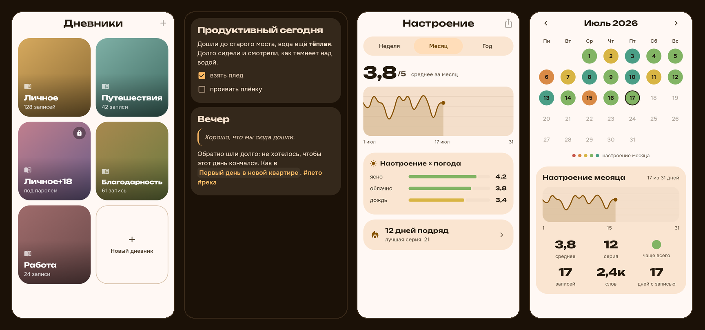

<div align="center">


# Wickly — Personal Journal

<br>

[](https://github.com/THET1ME-1/Wickly/releases/latest)
[](https://github.com/THET1ME-1/Wickly/releases)
[](LICENSE)
[](https://github.com/THET1ME-1/Wickly/stargazers)


**A warm personal journal with no account** — entries, mood, photos and habits live on your device, encrypted; sync goes straight between your own devices. No cloud, no ads, no trackers.

🇷🇺 🇬🇧 🇩🇪 🇫🇷 🇪🇸 🇮🇹 🇵🇹 · 7 languages

[**⬇ Download**](https://github.com/THET1ME-1/Wickly/releases/latest) · [English](#english) · [Русский](#-wickly-русский)

<br>



</div>

---

## English

**Wickly** is a personal journal that asks for nothing. No email, no password, no account — the diary is yours from the first second. Entries are encrypted on the device (AES-256-GCM) and sync directly between your own devices over the local network or a shared Syncthing folder.

### Stack
Flutter · Material 3 Expressive · SQLite with CRDT for serverless sync · Unbounded + Onest.

### Features
- **Editor** — markdown highlighted right in the input field, autosave, photos and voice inside the text, hashtags become tags, backdated entries, place and weather. An entry splits into topics that the reader draws as cards.
- **Covers** — your own photo with a crop frame, a fresh camera shot, or a picture matched to the topic from [Openverse](https://openverse.org) (free licenses, author credited).
- **Looking back** — feed with streaks and "on this day", mood calendar, mosaic media grid, map of entries, memories, search with filters.
- **Mood and habits** — emotions and activities in the spirit of Daylio, your own ones among 176 icons, trackers and habits, statistics with correlations.
- **Privacy** — PIN and biometrics, a separate password per journal, hidden entries, `FLAG_SECURE` against screenshots.
- **Sync without a server** — pair devices by QR over the local network, or drop CRDT packets into a Syncthing folder. Nothing leaves your devices.
- **Import** — bring your diary over from Diaro or StoryPad, photos included.
- **Export** — Markdown, JSON, TXT, a printable PDF book, and an encrypted backup.
- **Anywhere** — an Android phone, a home-screen widget, and a desktop layout for Linux with three window arrangements.
- **Endless themes** — any color through the picker, 4 theme modes, AMOLED, Material You.

### Install (Android)
Distributed **only via GitHub Releases** (not on Google Play).

**Recommended — [Obtainium](https://github.com/ImranR98/Obtainium)** (auto-updates):
1. Install Obtainium.
2. **Add App** → paste `https://github.com/THET1ME-1/Wickly` → Add.
3. It finds the latest release; pick the APK for your CPU (`arm64-v8a` — almost all modern phones).

One-tap: `obtainium://add/https://github.com/THET1ME-1/Wickly`

Or download the APK from the [releases page](https://github.com/THET1ME-1/Wickly/releases/latest). The app also updates itself: it checks GitHub Releases once a day.

Signing fingerprint (SHA-256) to verify the APK:
`14:22:98:4A:B0:74:4B:BC:19:10:B4:0F:4F:6E:94:D5:8B:76:16:FC:ED:F5:E2:E8:91:FB:BC:94:F3:AE:2A:F2`

### Install (Linux)
Download `Wickly-X.Y.Z-linux-x64.tar.gz` from the [releases page](https://github.com/THET1ME-1/Wickly/releases/latest), unpack it and run the installer:

```bash
tar xzf Wickly-*-linux-x64.tar.gz && cd Wickly-*-linux-x64
./install.sh          # ~/.local/lib/wickly + the `wickly` command + a desktop entry
./install.sh --remove # removes the app, keeps the journal
```

### Privacy
No account, no analytics, no ad SDKs. The app reaches the network in exactly three cases: weather for an entry (Open-Meteo), cover search (Openverse) and the update check (GitHub). Sync runs between your own devices only. Details — [docs/privacy-policy.md](docs/privacy-policy.md).

### Development
```bash
flutter pub get
flutter run
```

Checks:
```bash
flutter test                       # tests
flutter test test_golden           # screen snapshots in three theme modes
dart run tool/db_smoke.dart        # data layer on a real SQLite+CRDT
dart run tool/sync_smoke.dart      # sync: merging two live databases
```

### License
[GPL-3.0](LICENSE) — free software with copyleft: any fork or derivative, when distributed, stays open under the same license.

---

## 🔥 Wickly (Русский)

**Wickly** — личный дневник, который ничего не просит. Ни почты, ни пароля, ни аккаунта: дневник твой с первой секунды. Записи шифруются на устройстве (AES-256-GCM) и синхронизируются напрямую между твоими устройствами — по домашней сети или через общую папку Syncthing.

### Стек
Flutter · Material 3 Expressive · SQLite с CRDT для синхронизации без сервера · Unbounded + Onest.

### Особенности
- **Редактор** — подсветка markdown прямо в поле ввода, автосохранение, фото и голос внутри текста, хэштеги превращаются в теги, дата задним числом, место и погода. Запись раскладывается на темы, и читалка рисует их карточками.
- **Обложки** — своё фото с рамкой обрезки, снимок с камеры или картинка по теме из [Openverse](https://openverse.org) (свободные лицензии, автор указывается).
- **Взгляд назад** — лента с сериями и «в этот день», календарь настроения, медиа-сетка мозаикой, карта записей, воспоминания, поиск с фильтрами.
- **Настроение и привычки** — эмоции и действия в духе Daylio, свои среди 176 иконок, трекеры и привычки, статистика с корреляциями.
- **Приватность** — код и биометрия, отдельный пароль на дневник, скрытые записи, `FLAG_SECURE` против скриншотов.
- **Синхронизация без сервера** — сопряжение по QR в домашней сети или пакеты CRDT через папку Syncthing. Наружу не уходит ничего.
- **Импорт** — перенос дневника из Diaro и StoryPad вместе с фотографиями.
- **Экспорт** — Markdown, JSON, TXT, PDF-книга под печать и шифрованный бэкап.
- **Где угодно** — телефон на Android, виджет на домашнем экране и десктопная раскладка для Linux с тремя вариантами окна.
- **Бесконечные темы** — любой цвет через колор-пикер, 4 режима темы, AMOLED, Material You.

### Установка (Android)
Раздаётся **только через GitHub Releases** (в Google Play приложения нет).

**Лучше всего — [Obtainium](https://github.com/ImranR98/Obtainium)** (сам обновляет):
1. Поставь Obtainium.
2. **Add App** → вставь `https://github.com/THET1ME-1/Wickly` → Add.
3. Он найдёт последний релиз; выбери APK под свой процессор (`arm64-v8a` — почти все современные телефоны).

В одно касание: `obtainium://add/https://github.com/THET1ME-1/Wickly`

Или скачай APK со [страницы релизов](https://github.com/THET1ME-1/Wickly/releases/latest). Приложение умеет обновляться и само — раз в сутки смотрит GitHub Releases.

Отпечаток подписи (SHA-256) для проверки APK:
`14:22:98:4A:B0:74:4B:BC:19:10:B4:0F:4F:6E:94:D5:8B:76:16:FC:ED:F5:E2:E8:91:FB:BC:94:F3:AE:2A:F2`

### Установка (Linux)
Скачай `Wickly-X.Y.Z-linux-x64.tar.gz` со [страницы релизов](https://github.com/THET1ME-1/Wickly/releases/latest), распакуй и запусти установщик:

```bash
tar xzf Wickly-*-linux-x64.tar.gz && cd Wickly-*-linux-x64
./install.sh          # ~/.local/lib/wickly + команда `wickly` + ярлык
./install.sh --remove # убирает приложение, дневник не трогает
```

### Приватность
Ни аккаунта, ни аналитики, ни рекламных SDK. В сеть приложение выходит ровно в трёх случаях: погода для записи (Open-Meteo), поиск обложки (Openverse) и проверка обновления (GitHub). Синхронизация идёт только между твоими устройствами. Подробности — [docs/privacy-policy.md](docs/privacy-policy.md).

### Разработка
```bash
flutter pub get
flutter run
```

Проверки:
```bash
flutter test                       # тесты
flutter test test_golden           # снимки экранов в трёх режимах темы
dart run tool/db_smoke.dart        # слой данных на настоящем SQLite+CRDT
dart run tool/sync_smoke.dart      # синхронизация: слияние двух живых баз
```

### Лицензия
[GPL-3.0](LICENSE) — свободное ПО с копилефтом: форк или производная работа при распространении остаётся открытой под той же лицензией.

*Дизайн-ДНК общая с Kadr и Fern: единый seed-цвет → `ColorScheme.fromSeed`, пилюли-кнопки, карточки с радиусом 28.*

---

<div align="center">

<sub>🔥 Wickly · Flutter · Material 3 Expressive · без аккаунта, без облака, без трекеров</sub>

<sub>Подпись приложения: <code>CN=Wickly, OU=THET1ME-1</code></sub>

</div>
