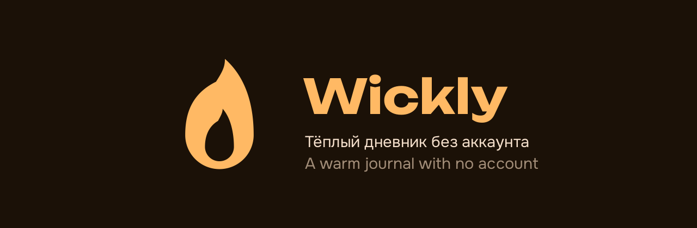

# Знак Wickly — «Огонёк»

Знак читает само имя: **wick** — фитиль. Приложение про вечер, когда человек
садится, зажигает лампу и записывает день, поэтому знак греет, а не охраняет:
замков, щитов и сейфов в нём нет.



## Форма

Язык пламени с вычтенным ядром, одна фигура, правило заливки `evenodd`.

Симметричная капля читается водой — первая версия знака этим и болела. Огонь
узнают по трём вещам, и все три заданы числами:

- **острие** — вершина сходится в точку;
- **наклон** — вершина уведена вправо на `lean` от полуширины;
- **перегиб** — левый бок поджимается на высоте `waist` и уходит к вершине
  вогнутой дугой.

Геометрия живёт в одном месте — `tool/gen_icon.py`, функция `flame()`. Поле
знака 100×100, габарит фигуры **52 × 84**.

| Параметр | Внешний контур | Ядро |
|---|---|---|
| ось `cx` | 50 | 50 |
| вершина `top` | 8 | 46 |
| полуширина `w` | 26 | 11 |
| низ `bottom` | 92 | 86 |
| наклон `lean` | 0.16 | 0.22 |
| перегиб `waist` | 0.30 | 0.32 |

Низ обеих фигур — полуокружность радиуса `w`: она держит массу знака внизу,
из-за чего пламя стоит, а не висит.

## Посадка в иконку

Пропорции держит **одна пара чисел**, вторая выводится из первой:

```
FG_SCALE     = 0.45                    # высота знака от 108dp adaptive-холста
LEGACY_SCALE = FG_SCALE * 108 / 72     # = 0.675, высота знака от legacy-PNG
```

Множитель `108/72` берётся из того, что маска Android показывает центральные
72dp из 108. Благодаря ему legacy-PNG и adaptive-иконка дают **один видимый
размер**. Менять эти числа можно только вместе, иначе иконка начнёт прыгать
между лаунчерами.

Проверка safe zone: при `FG_SCALE = 0.45` знак занимает 48.6 × 30.1 dp,
диагональ габарита **57.2 dp** против разрешённых **66 dp** — с запасом.

Смотреть результат надо симуляцией масок (круг, суперэллипс), а не на глаз:
иконка, красивая в квадрате, легко теряет края под круглой маской.

## Колеровки

| id | Фон | Знак | Где |
|---|---|---|---|
| `amber` | `#FFB964` | `#1B1107` | **по умолчанию** — читается на любых обоях |
| `ember` | `#1B1107` | `#FFB964` | огонь во тьме; на тёмных обоях подложка теряет край |
| `cream` | `#FFF8F4` | `#8A5200` | бумага, для светлых лаунчеров |

Заливка строго плоская. Градиентов в проекте нет ни в интерфейсе, ни в знаке.

Дефолт выбран проверкой: `ember` красивее по смыслу, но его почти чёрная
подложка растворяется на тёмных обоях — ровно та беда, на которой уже
обожглись в Kadr.

## Что генерируется

```
python3 tool/gen_icon.py --tint amber      # нужен cairosvg + pillow
```

- `android/.../mipmap-*/ic_launcher.png` — legacy, подложка-суперэллипс;
- `ic_launcher_foreground.png`, `ic_launcher_monochrome.png` — 108dp,
  прозрачный фон; монохром уходит в тематические иконки Android 13+;
- `mipmap-anydpi-v26/ic_launcher.xml` + `values/ic_launcher_background.xml`;
- `web/favicon.png`, `web/icons/Icon-*.png` (maskable рисуется мельче —
  PWA-маска съедает край);
- `docs/logo/mark.svg` (знак `currentColor`), `icon-<tint>.svg`,
  `icon-512.png`, `banner.png`.

Иконку Linux-сборки берёт `linux/packaging/install.sh` из
`mipmap-xxxhdpi/ic_launcher.png` — отдельного файла ей не нужно.

## Витрина экранов

`docs/logo/screenshots.png` (1728×812) — четыре экрана в ряд под шапкой README.
Собирает `python3 tool/gen_shots.py` из снимков `test_golden/goldens/`, поэтому
после `flutter test --update-goldens test_golden` витрину надо пересобрать.
Экраны перечислены в `SHOTS`; тёмный кадр среди светлых стоит намеренно —
обе темы видны сразу. Фон холста — уголь знака, кадры обведены: без обводки
тёмный экран сливается с фоном и читается дырой.

## Не сделано

Выбор колеровки в настройках через `activity-alias`, как в Kadr и Togetherly.
Ресурсы для этого уже считаются одной командой — не хватает только alias'ов в
манифесте, канала `app_icon` и экрана выбора.
